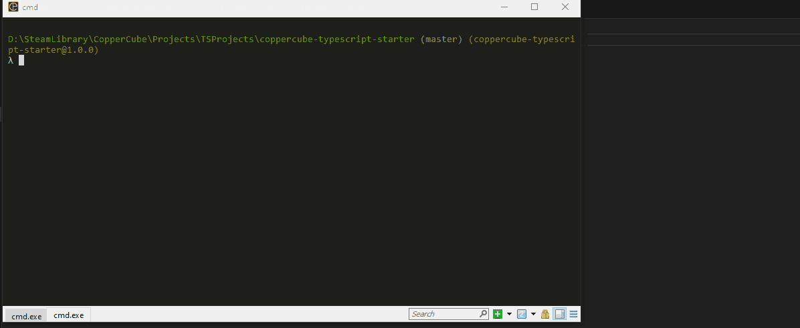

#CopperCube TypeScript Starter

###Write CopperCube scripts using TypeScript.

CopperCube is a JavaScript engine using SpiderMonkey v1.8 which is pretty old. This template project enables using TypeScript so you can transpile your JS files to SpiderMonkey. Officially SpiderMonkey 1.8 is not supported by TypeScript. Closes equivalent is ES3. So This it transpiles into ES3 which is pretty close. It should work for most cases but still, there are cases you need to double check.

This template also enables using multiple files. With CopperCube you can only a single JavaScript file along with your ccb file. (eg. game.ccb, game.js). This excludes behaviours and actions. You can still use behaviours and actions as much as you want and need. All this template does is, it concats multiple TS files into a single JS file so you can use TS and separate your game logic into multiple files and folders. It also provides code completion. Types added so you can make use of code completion.

###Some gotchas

* Do not use `console.log`. Use `print` instead.
* Do not alter anything inside `dist` folder. They will be overwritten by `tsc`.

##How to Use This Template

1. Copy your `ccb` file into `/coppercube` folder
2. Rename it to `game.ccb`. If you don't want to rename it to `game.ccb` and use your own project name, then change the `outputFile` in `concatenater.js`
3. `npm run build`
4. `npm run concat`
5. Both terminal apps will listen to file changes so keep them running
6. Create your TypeScript files in `src` folder. You can add as much files as you want. 
7. Anytime you add a new file, make sure to add it into `files` array in `concatenater.js`. And make sure to use `js` as the extension not `ts`.
8. Place your ccb file into /coppercube folder and run from there.
9. `dist` and `coppercube` folders are gitignored. If you want to commit your ccb file, you may do so by altering gitignore. But since it's a binary file, it's no advised.